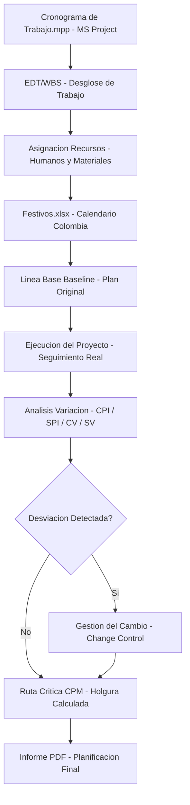

# Planificación, Ejecución y Gestión del Cambio en Microsoft Project

> Planificación y control de proyectos con Microsoft Project: cronograma baseline, recursos, festivos y gestión del cambio.

## Descripción

---

Laboratorio de gestión de proyectos con **Microsoft Project**: construcción del cronograma de trabajo con línea base (baseline), asignación de recursos humanos y materiales, configuración de festivos nacionales colombianos, análisis de variación CPI/SPI, y procedimiento de gestión del cambio formal ante desviaciones del plan.

## Contenido del repositorio

| Archivo | Descripción |
|---|---|
| `*.mpp` | Proyecto MS Project con cronograma completo |
| `Festivos.xlsx` | Calendario de festivos para configuración de MS Project |
| `*.pdf` | Informe de planificación, ejecución y control |
| `*.docx` | Documentación del laboratorio |

## Arquitectura

## Conceptos aplicados

- Construcción de EDT/WBS y asignación de duraciones
- Configuración de recursos y nivelación de sobreasignaciones
- Línea base (Baseline) y seguimiento de variaciones (CV, SV, CPI, SPI)
- Ruta crítica (CPM) y análisis de holgura
- Proceso formal de gestión del cambio (Change Control)

## Contexto académico

**Asignatura:** Dirección y Gestión Empresas TI · **Institución:** UNIR · Ingeniería Informática
**Autor:** Alejandro De Mendoza — Ingeniero Informático · Máster Arquitectura de Software

---

## Autor

**Alejandro De Mendoza**  
Ingeniero Informático · Especialista en IA · Especialista en Ingeniería de Software · Máster en Arquitectura de Software

